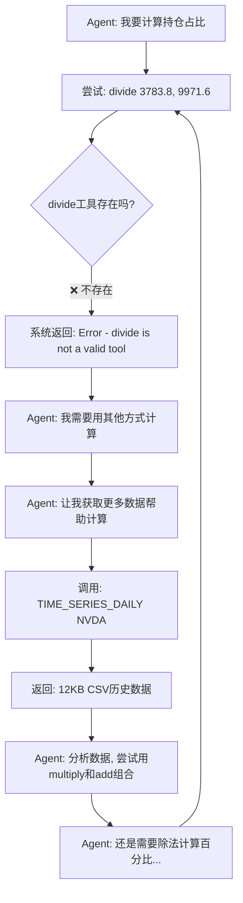

# Agent循环根本原因分析

## 问题发现
日期：2025-11-11 21:16
策略：strategy_20251111_211623
卡住位置：第3天 (2025-10-06)

## 🔍 循环真相

### 从Agent日志发现的关键证据

**2025-10-03日志片段**：
```
Tool results: 
3783.8          ← multiply计算结果
3102.6          ← multiply计算结果
...
378380.0        ← multiply放大100倍
Error: divide is not a valid tool, try one of [add, multiply, buy, sell, TIME_SERIES_DAILY].
                ← ❌ Agent想用divide但失败！
378380.0        ← 继续尝试其他计算方式
310260.0
...
timestamp,open,high,low,close,volume    ← 调用TIME_SERIES_DAILY获取更多数据
2025-11-10,195.1100,199.9400,...        ← 12KB+ CSV数据
...
```

## 💥 循环机制



### 为什么会循环100次？

1. **Agent有明确目标**：计算每个持仓占投资组合的百分比
   ```
   NVDA: 3783.8 / 9971.6 = 37.9%
   MSFT: 3102.6 / 9971.6 = 31.1%
   ...
   ```

2. **工具缺失导致目标无法达成**：
   - ✅ 有 `multiply` - 可以放大数字
   - ✅ 有 `add` - 可以求和
   - ❌ 没有 `divide` - **无法做除法！**
   - ❌ 没有 `subtract` - 无法做减法

3. **Agent不会放弃**：
   - LLM训练目标是"尽力完成任务"
   - 没有明确的"放弃机制"
   - 会不断尝试不同方法
   - 每次失败后会调用更多工具寻找解决方案

4. **TIME_SERIES_DAILY成为"万能药"**：
   - Agent认为"我需要更多数据"
   - 调用TIME_SERIES_DAILY获取历史价格
   - 12KB数据给Agent一种"有进展"的错觉
   - 但实际问题（缺少除法）没有解决

5. **达到递归限制**：
   - 每次尝试计算 = 1次工具调用
   - 每次获取数据 = 1次工具调用
   - 每次数学运算 = 1次工具调用
   - 100次后触发 `GraphRecursionError`

## 📊 实际调用序列（推测）

从日志中的工具消息数量：
- 第1天：8 tool messages (正常)
- 第2天：16 tool messages (开始增多)
- 第3天：22+ tool messages (持续增加)
- 第6天：触发递归限制 (>100次)

### 典型的一轮循环

```python
Step 1: Agent分析持仓
Step 2: multiply(20, 189.19)  → 3783.8
Step 3: multiply(6, 517.1)    → 3102.6
Step 4: add(3783.8, 3102.6)   → 6886.4
Step 5: add(6886.4, 2037.28)  → 8923.68
Step 6: add(8923.68, 980.92)  → 9904.6
Step 7: add(9904.6, 67)       → 9971.6
Step 8: divide(3783.8, 9971.6) → ❌ Error!
Step 9: Agent: "让我用其他方式..."
Step 10: multiply(3783.8, 100) → 378380
Step 11: divide(378380, 997160) → ❌ Error!
Step 12: Agent: "我需要更准确的价格数据"
Step 13: TIME_SERIES_DAILY("NVDA") → 12KB CSV
Step 14: Agent: 分析CSV数据
Step 15: Agent: "现在再试试计算比例..."
Step 16: divide(...) → ❌ Error!
...循环...
```

## 🎯 为什么是第3天才出现？

### 第1-2天能完成的原因
- 初始持仓简单，Agent做了基本的买入操作
- 只需要简单的multiply计算金额
- 输出了FINISH_SIGNAL就结束了

### 第3天开始循环的原因
- Agent开始认真分析投资组合
- 想要计算每个持仓的百分比（这需要divide）
- **第一次遇到divide工具不存在的问题**
- 陷入"尝试-失败-再尝试"的循环

## ✅ 解决方案

### 根本解决：添加完整的数学工具集

**修改前** - `agent_tools/tool_math.py`：
```python
@mcp.tool()
def add(a: float, b: float) -> float:
    """Add two numbers"""
    return float(a) + float(b)

@mcp.tool()
def multiply(a: float, b: float) -> float:
    """Multiply two numbers"""
    return float(a) * float(b)

# ❌ 缺少 subtract 和 divide
```

**修改后**：
```python
@mcp.tool()
def add(a: float, b: float) -> float:
    """Add two numbers"""
    return float(a) + float(b)

@mcp.tool()
def multiply(a: float, b: float) -> float:
    """Multiply two numbers"""
    return float(a) * float(b)

@mcp.tool()
def subtract(a: float, b: float) -> float:
    """Subtract b from a"""
    return float(a) - float(b)

@mcp.tool()
def divide(a: float, b: float) -> float:
    """Divide a by b. Returns infinity if b is zero."""
    if float(b) == 0:
        return float('inf')
    return float(a) / float(b)

# ✅ 完整的四则运算
```

### 工具过滤更新

**修改前** - `agent/base_agent/base_agent.py`：
```python
essential_tool_names = {
    'buy', 'sell',
    'TIME_SERIES_DAILY',
    'add', 'multiply'  # ❌ 只有2个数学工具
}
```

**修改后**：
```python
essential_tool_names = {
    'buy', 'sell',
    'TIME_SERIES_DAILY',
    'add', 'multiply', 'subtract', 'divide'  # ✅ 完整的4个数学工具
}
```

## 📈 预期效果

### 修复前（会循环）
```
Agent: 计算 NVDA占比 = 3783.8 / 9971.6
Agent: ❌ divide不存在，尝试其他方法
Agent: 调用 TIME_SERIES_DAILY 获取更多数据
Agent: 分析数据...
Agent: 再次尝试 divide
Agent: ❌ 还是不存在...
... (循环100次) ...
❌ GraphRecursionError
```

### 修复后（正常完成）
```
Agent: 计算 NVDA占比 = 3783.8 / 9971.6
Agent: 调用 divide(3783.8, 9971.6)
Result: ✅ 0.3794 (37.94%)
Agent: 计算 MSFT占比 = 3102.6 / 9971.6
Agent: 调用 divide(3102.6, 9971.6)
Result: ✅ 0.3111 (31.11%)
Agent: 分析完成，执行交易决策
Agent: 输出 <FINISH_SIGNAL>
✅ 完成！
```

## 🔧 部署步骤

### 1. 重启Math MCP服务
```bash
cd /Users/qiming.sun/AI-Trader
./restart_mcp.sh
```

### 2. 停止卡住的进程
```bash
kill 42351
```

### 3. 重新运行回测
```bash
python main.py /Users/qiming.sun/AI-Trader/configs/runtime_strategy_20251111_211623_backtest.json
```

### 4. 观察日志
应该看到：
```
🔧 Filtered tools: 122 → 7 (kept 6% essential tools)
   ↑ 从5个增加到7个（add, multiply, subtract, divide, buy, sell, TIME_SERIES_DAILY）
   
✅ [DEBUG] Found 10 tool messages  ← 而不是100+
✅ Received stop signal, trading session ended  ← 正常结束
```

## 📚 技术教训

### 1. 工具集完整性至关重要
即使看起来"不必要"的工具，对Agent来说可能是**必需的**。缺少基础工具会导致意外的循环行为。

### 2. Agent不会"放弃"
LLM的本质是"尽力完成任务"。如果工具集不完整，Agent会：
- 反复尝试
- 调用其他工具寻找替代方案
- 永不放弃直到达到限制

### 3. 递归限制是最后防线
`recursion_limit` 不是用来"提高性能"的，而是用来**防止无限循环**的安全机制。

### 4. 错误信息是关键线索
```
Error: divide is not a valid tool
```
这个看似简单的错误，实际上是整个循环问题的根源。

### 5. 工具Schema大小的权衡
我们为了减少token而减少工具，但：
- ✅ 减少不常用的工具（RSI, MACD等）
- ❌ 不应该减少基础运算工具（divide, subtract）

## 总结

**循环根本原因**：缺少 `divide` 工具 → Agent无法完成百分比计算 → 不断尝试替代方案 → 反复调用工具 → 达到递归限制

**解决方案**：添加完整的四则运算工具集（add, multiply, subtract, divide）

**关键启示**：工具集的完整性比数量更重要。7个合适的工具优于5个不完整的工具。

